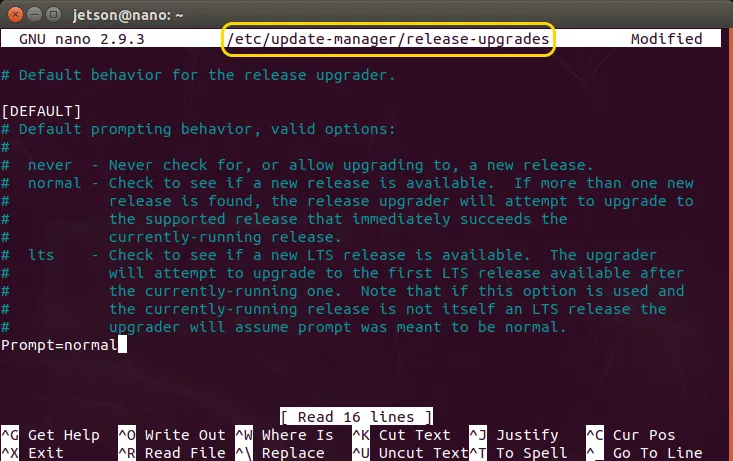

# Configure NVIDIA Jetson Nano with Ubuntu 22.04 Headless

## Background

The instructions here outline the steps we've followed to configure an NVIDIA Jetson Nano with Ubuntu 22.04 server in a headless configuration. Optionally, the device may be upgraded to Ubuntu 20.04 with Desktop.

These instructions are meant to be concise and a reference, but not comprehensive. Familiarity with Linux and Jetson Nano is required. See the refereces section below for more detailed walkthroughs from which many of these steps derive.

[!NOTE] NVIDIA Jetson Nano is a different product from NVIDIA Jetson *Orin* Nano. Jetson Orin Nano is a later generation product that should be easily configured with Ubuntu 22.04 or later following the product user guides. The instructions here apply only to NVIDIA Jetson Nano.

Jetson Nano firmware is released as part of the [NVIDIA SDK Manager](https://developer.nvidia.com/sdk-manager). The firmware, Jetson Linux, and Jetson SDK, collectively known as Jetpack, are downloaded and programmed to the device using the SDK Manager. **The latest Jetpack SDK that supports NVIDIA Jetson Nano is Jetpack 4.6.3**

## Requirements

1. Host computer running Ubuntu Desktop 18.04, 20.04, or 22.04
1. NVIDIA Jetson Nano

## Outline

1. Use NVIDIA SDK Manager to flash the Jetson Nano with Jetpack 4.6.3.
    - [SDK Manager](https://developer.nvidia.com/sdk-manager)
    - [Jetpack 4.6.3](https://developer.nvidia.com/jetpack-sdk-463)
    - [Jetson Linux 32.7.3](https://developer.nvidia.com/embedded/linux-tegra-r3273) which is based on Ubuntu Desktop 18.04 (Bionic Beaver)
1. Remove Ubuntu Desktop features
1. Upgrade to Ubuntu 20.04
1. (optionally) install Ubuntu Desktop
1. Upgrade to Ubuntu 22.04

## Program the Jetson Nano with Jetpack 4.6.3 (Ubuntu 18.04)

[!NOTE] The release page for Jetpack 4.6.3 does not appear to contain a download link for this version, and instead links to a download for 4.6.3. Jetpack 4.6.3 will be downloaded by the SDK Manager directly.

Download and install [SDK Manager](https://developer.nvidia.com/sdk-manager) onto your host machine.

### Bypass SDK Manager limit of Ubuntu 18.04 host operating system

If you are running Ubuntu 20.04 or later, SDK Manager will report your operating system is not compatible with flashing the NVIDIA Jetson. This turns out to be an unncessessary limitation, and SDK Manager works fine with 20.04 and 22.04 if this limitation is bypassed.

You may skip this step if you are running Ubuntu 18.04.

Tricking `lsb_release` to report your distribution as 18.04 will bypass the limitation in SDK Manager. First backup your OS release information and then substitute a replacement that feigns 18.04:

```bash
sudo cp /usr/lib/os-release /usr/lib/os-release-current
sudo cp /usr/lib/os-release /usr/lib/os-release-bionic
```

Edit `os-release-bionic` with the relevant release information for Ubuntu 18.04:

```bash
sudo nano /usr/lib/os-release/os-release-bionic
```

```bash
PRETTY_NAME="Ubuntu 18.04.5 LTS"
NAME="Ubuntu"
VERSION_ID="18.04"
VERSION="18.04.5 LTS (Bionic Beaver)"
VERSION_CODENAME=bionic
ID=ubuntu
ID_LIKE=debian
HOME_URL="https://www.ubuntu.com/"
SUPPORT_URL="https://help.ubuntu.com/"
BUG_REPORT_URL="https://bugs.launchpad.net/ubuntu/"
PRIVACY_POLICY_URL="https://www.ubuntu.com/legal/terms-and-policies/privacy-policy"
UBUNTU_CODENAME=bionic
```

Replace the system `os-release` file with the Bionic version:

```bash
sudo cp /usr/lib/os-release/os-release-bionic /usr/lib/os-release/os-release
```

This file will be restored once SDK Manager has completed flashing.

### Flash Jetpack 4.6.3

Launch NVIDIA SDK Manager and follow the instructions in [Install Jetson Software with SDK Manager](https://docs.nvidia.com/sdk-manager/install-with-sdkm-jetson/index.html) to flash Jetson 4.6.3 to your Jetson Nano.

Do not install additional SDKs, and uncheck all Jetson SDK Components. The only target components to install should be the Jetson OS.

You may see messages that installation of packages to your local host have failed, or that the overall installation failed. As long as the OS was flashed and boots, the firmware has been loaded successfully.

### Restore OS release

Revert to your system `os-release` file:

```bash
sudo cp /usr/lib/os-release/os-release-bionic /usr/lib/os-release/os-release
```

## Upgrade Jetson Nano to Ubuntu Server 20.04

### Prepare Ubuntu 18.04 for upgrade

The following comands are all run on the Jetson Nano using either SSH or a keyboard / mouse / monitor attached to the device.

#### Remove Docker

The docker installation in 18.04 is very outdated and should be removed prior to upgrading. A more modern version can be installed following the operating system upgrades.

```bash
sudo apt remove --purge docker docker.io containerd
sudo rm -rf /etc/docker
```

#### Remove Ubuntu 18.04 Desktop applications

Remove Ubuntu Desktop applications, even if you plan to install Ubuntu Desktop later. This prevents some failures during upgrading, especially Chromium which will cause Ubuntu upgrade to fail if it is present. It's cleaner to remove the applications from the older distribution and then install later versions that correspond with the upgraded OS.

```bash
sudo apt remove --purge chromium-*
sudo apt remove --purge libreoffice*
sudo apt remove --purge thunderbird*
sudo apt remove --purge ffmpeg smplayer* vlc-*
sudo apt remove --purge youtube-dl
sudo apt remove --purge mobile-broadband-provider-info modemmanager
sudo apt remove --purge example-content
```

Rather than upgrade Java, remove it prior to upgrading and install a later version after upgrading if needed.

```bash
sudo apt remove --purge openjdk*
```

#### Remove Ubuntu Desktop

Set the default boot target to `multi-user.target` to boot into the console instead of XWindows.

```bash
sudo systemctl set-default multi-user.target
sudo reboot
```

Remove Ubuntu Desktop:

```bash
sudo apt remove --purge --auto-remove \
    ubuntu-desktop \
    ubuntu-gnome-desktop \
    ubuntu-artwork \
    ubuntu-wallpaper* \
    gnome-* libgnome* \
    plymouth-theme* \
    light-themes \
    kde-window-manager kinit kwin-common kwin-x11 \
    lxde lxde-* lxdm lxlock lxsession* \
    xserver* \
    xorg \
    x11-common x11-utils \
    unity unity-* \
    gdm gdm3 \
    lightdm \
    libgtk* gtk-* \
    xwayland \
    nautilus nautilus-* \
    zeitgeist-core libzeitgeist*
```

Remove `snap` (it will be reinstalled during the upgrade):

```bash
sudo apt remove --purge --autoremove snapd
```

Remove unused packages and reboot:

```bash
sudo apt autoremove
sudo reboot
```

### Upgrade to Ubuntu 20.04

Upgrade existing packages to the latest version:

```bash
sudo apt update
sudo apt upgrade
```

Install nano and modify Ubuntu Update Manager to allow distribution upgrades:

```bash
sudo apt install nano
sudo nano /etc/update-manager/release-upgrades
```

Set the line `Prompt=normal` in `/etc/update-manager/release-upgrades



Upgrade to Ubuntu 20.04

```bash
sudo do-release-upgrade
```

After the upgrade completes, reboot and log back in.

Set the default Python version to Python 3, which is the default for a fresh installation of Ubuntu 20.04.

```bash
sudo update-alternatives --install /usr/bin/python python /usr/bin/python3 10
sudo update-alternatives --install /usr/bin/python python /usr/bin/python2 5
```

Restore the NVIDIA l4t apt sources:

```bash
sudo mv /etc/apt/sources.list.d/nvidia-l4t-apt-sources.list.distUpgrade /etc/apt/sources.list.d/nvidia-l4t-apt-sources.list
```

Upgrade all packages:

```bash
sudo apt update
sudo apt upgrade
```

### (Optional) Install Ubuntu Desktop

If you wish to run Ubuntu Desktop, you may install it here. Note that due to kernel limitations, upgrading beyond Ubuntu 20.04 renders the desktop unusable.

The kernel for the Jetson Nano is developed and released by NVIDIA and is no longer supported. Consequently the kernel is locked at `4.9.337-tegra`. Ubuntu Desktop does not appear to work with this version beyond Ubuntu 20.04, which uses `xorg` version `1.20`. Later versions of Ubuntu use a later version of `xorg` which appears incompatible with the kernel.

```bash
sudo apt install ubuntu-desktop
```

Follow the instructions in [Q-Engineering - Install Ubuntu 20.04 on Jetson Nano](https://qengineering.eu/install-ubuntu-20.04-on-jetson-nano.html) to configure Wayland, X11 video driver, and Vulkan, then reboot. The steps are summarized here:
- Check that `WaylandEnable=false` is uncommented in `/etc/gdm3/custom.conf`.
- Uncomment `Driver "nividia"` in file /etc/X11/xorg.conf.

## Upgrade Jetson Nano to Ubuntu Server 22.04

[!NOTE] If running Ubuntu Desktop, upgrading to Ubuntu Desktop 22.04 may result in XWindows breaking due to incompatibility with `xorg` and the Tegra kernel version. You may attempt to upgrade anyway by locking the version of `xorg` with `sudo apt-mark xorg=1.2`, and upgrade at your own risk.

Upgrade existing packages to the latest version:

```bash
sudo apt update
sudo apt upgrade
```

Install nano and modify Ubuntu Update Manager to allow distribution upgrades:

```bash
sudo apt install nano
sudo nano /etc/update-manager/release-upgrades
```

Set the line `Prompt=normal` in `/etc/update-manager/release-upgrades


Upgrade to Ubuntu 22.04

```bash
sudo do-release-upgrade
```

After the upgrade completes, reboot and log back in.

Restore the NVIDIA l4t apt sources:

```bash
sudo mv /etc/apt/sources.list.d/nvidia-l4t-apt-sources.list.distUpgrade /etc/apt/sources.list.d/nvidia-l4t-apt-sources.list
```

Upgrade all packages:

```bash
sudo apt update
sudo apt upgrade
```

### (optional) Resolve SSSD boot error

This is not required but will resolve a boot error regarding SSSD.

```bash
sudo cp /usr/lib/aarch64-linux-gnu/sssd/conf/sssd.conf /etc/sssd/.
sudo chmod 600 /etc/sssd/sssd.conf
```

## Install Docker

The Tegra kernel version in Jetpack 4.6.3 does not fully support `cgroups` v2, which is a dependency of docker. To work around this, enable `cgroups` v1 by appending the following line to the `APPEND` section in the grub configuration `/boot/extlinux/extlinux.conf`:

```
systemd.unified_cgroup_hierarchy=0
```

See [bpf_prog_query(BPF_CGROUP_DEVICE) failed: function not implemented: unknown](https://github.com/NVIDIA/nvidia-container-toolkit/issues/137) for more information about the error that will present if `cgroups` v2 is not supported.

The Ubuntu upgrade process installs `iptables-nft` as the default IP tables, which is not compatible with docker. Downgrade IP tables:

```bash
sudo update-alternatives --set iptables /usr/sbin/iptables-legacy
sudo update-alternatives --set ip6tables /usr/sbin/ip6tables-legacy
```

Reboot to apply the kernel `cgroups` setting and new IP tables alternative:

```bash
sudo reboot
```

Install docker (see [official docker install instructions](https://docs.docker.com/engine/install/ubuntu/))

```bash
# Add Docker's official GPG key:
sudo apt update
sudo apt install ca-certificates curl
sudo install -m 0755 -d /etc/apt/keyrings
sudo curl -fsSL https://download.docker.com/linux/ubuntu/gpg -o /etc/apt/keyrings/docker.asc
sudo chmod a+r /etc/apt/keyrings/docker.asc

# Add the repository to Apt sources:
echo \
  "deb [arch=$(dpkg --print-architecture) signed-by=/etc/apt/keyrings/docker.asc] https://download.docker.com/linux/ubuntu \
  $(. /etc/os-release && echo "$VERSION_CODENAME") stable" | \
  sudo tee /etc/apt/sources.list.d/docker.list > /dev/null
sudo apt update

# Install docker
sudo apt install docker-ce docker-ce-cli containerd.io docker-buildx-plugin docker-compose-plugin
```

Add your user to the docker group, and re-login to apply group change:

```bash
sudo usermod -aG docker ${USER}
logout
```

Log back in and test docker:

```bash
docker run hello-world
```

## Install CUDA, OpenCV and other NVIDIA Packages

See [Q-Engineering - Install Ubuntu 20.04 on Jetson Nano](https://qengineering.eu/install-ubuntu-20.04-on-jetson-nano.html).

## References

- [Q-Engineering - Install Ubuntu 20.04 on Jetson Nano](https://qengineering.eu/install-ubuntu-20.04-on-jetson-nano.html)
- [NVIDIA Forums - SDK Manager 'Not Supported' on Linux](https://forums.developer.nvidia.com/t/sdkmanager-not-supported-on-linux/71742/26?page=2)
